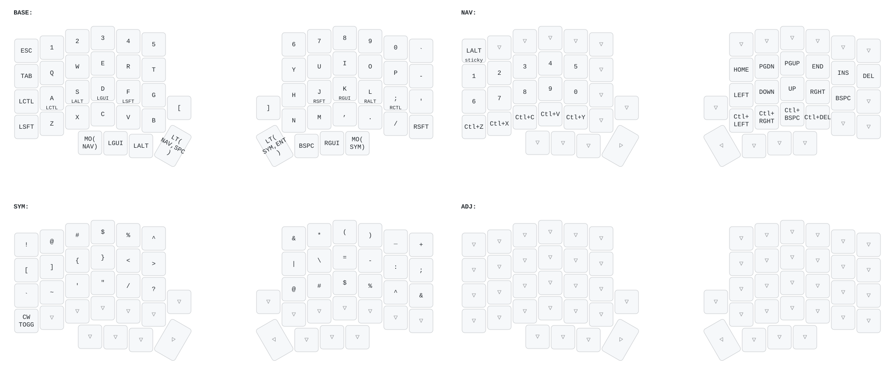
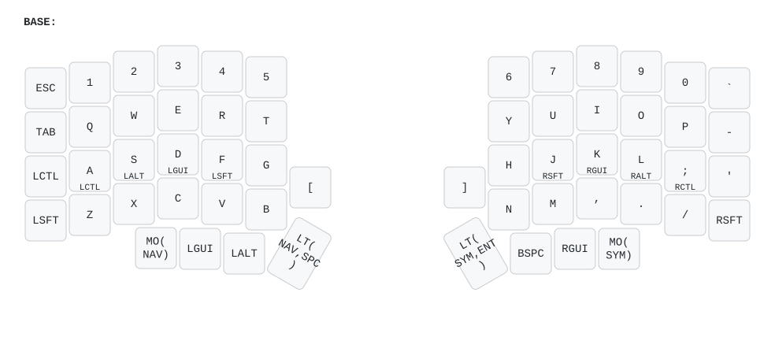
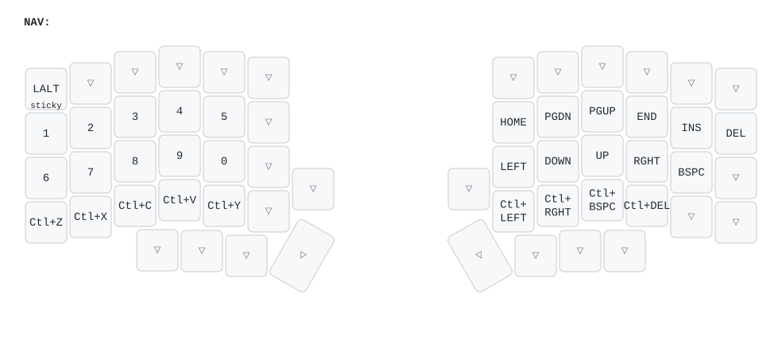
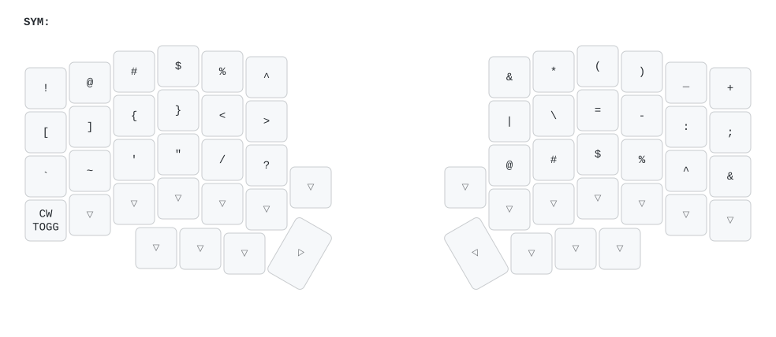
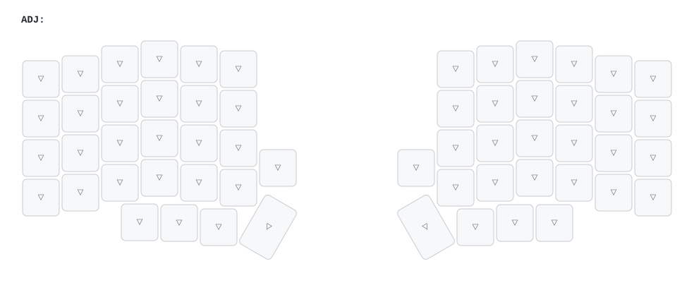

# caulk keymaps

## Lily58

Generated from `keyboards/lily58/keymaps/caulk/keymap.c`.

- `assets/lily58.keymap.json`: output of `qmk c2json -kb lily58/rev1 -km caulk`
- `assets/lily58.keymap.yaml`: output of `keymap parse -q assets/lily58.keymap.json -l BASE NAV SYM ADJ -c 6`

### Layers








### Regenerate

```
qmk c2json -kb lily58/rev1 -km caulk -o users/caulk/assets/lily58.keymap.json keyboards/lily58/keymaps/caulk/keymap.c
keymap parse -q users/caulk/assets/lily58.keymap.json -l BASE NAV SYM ADJ -c 6 -o users/caulk/assets/lily58.keymap.yaml
for layer in BASE NAV SYM ADJ; do keymap draw -k lily58/rev1 -l LAYOUT -s "$layer" -o users/caulk/assets/lily58_${layer}.svg users/caulk/assets/lily58.keymap.yaml; rsvg-convert users/caulk/assets/lily58_${layer}.svg -o users/caulk/assets/lily58_${layer}.png; done
magick montage users/caulk/assets/lily58_BASE.png users/caulk/assets/lily58_NAV.png users/caulk/assets/lily58_SYM.png users/caulk/assets/lily58_ADJ.png -tile 2x2 -geometry +0+0 users/caulk/assets/lily58_all_layers.png
```
